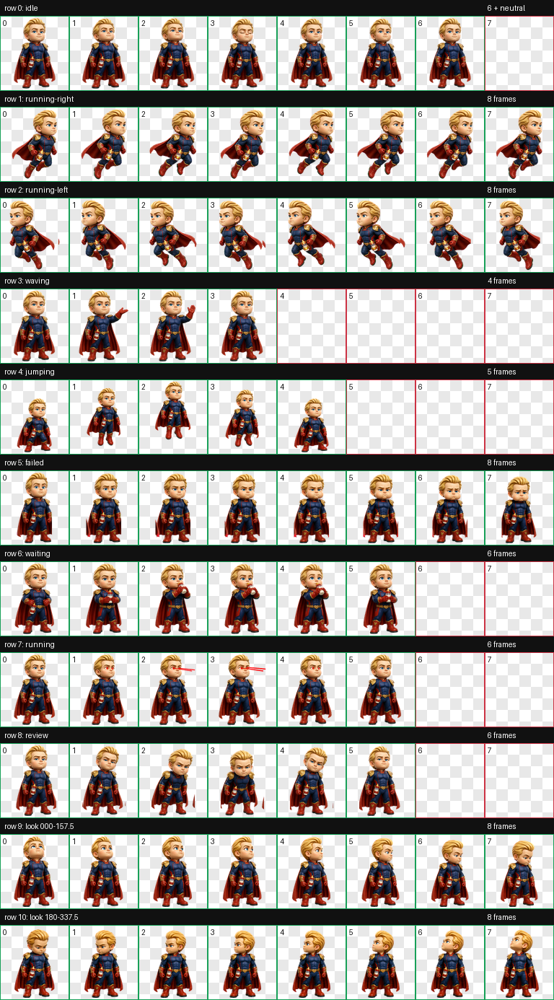

# homelander 祖国人：Codex 动态宠物

一个可直接安装到 Codex Desktop 的 v2 动态宠物。角色采用 Q 版 3D 收藏玩具风格，包含飞行、眼部激光、喝奶瓶、鼓腮嘟嘴、挥手，以及完整的 16 方向观察动画。

> 非官方同人作品，与 OpenAI、Amazon、Sony Pictures Television、DC Comics 或《黑袍纠察队》权利方无隶属、赞助或认可关系。角色名称、形象及相关权利归各自权利人所有。

## 预览



| 待机 | 飞行 | 激光工作 | 喝奶等待 | 鼓腮嘟嘴 |
| --- | --- | --- | --- | --- |
|  |  |  |  |  |

## 下载

推荐从 [Releases](https://github.com/FlutterSoul/homelander-codex-pet/releases/latest) 下载最新版：

1. 打开 Releases 页面。
2. 在 **Assets** 中下载 `homelander-chibi-codex-pet-v1.0.0.zip`。
3. 解压后会得到 `homelander-chibi` 文件夹。
4. 将整个文件夹复制到 `%USERPROFILE%\.codex\pets\`。

也可以点击 GitHub 页面右上角的 **Code → Download ZIP**，解压仓库后使用根目录中的 `pet.json`、`spritesheet.webp` 和 `install.ps1`。

## Windows 安装

### 方法一：安装 Release 压缩包

将解压得到的文件夹复制到：

```text
C:\Users\你的用户名\.codex\pets\homelander-chibi\
```

安装后目录应为：

```text
homelander-chibi/
├── pet.json
└── spritesheet.webp
```

重新启动 Codex，在宠物选择列表中选择 **小祖国人**。

### 方法二：从仓库自动安装

在解压后的仓库目录中运行：

```powershell
powershell -ExecutionPolicy Bypass -File .\install.ps1
```

脚本只会把 `pet.json` 和 `spritesheet.webp` 复制到当前用户的 Codex 宠物目录。

### 方法三：从仓库手动安装

```powershell
$target = Join-Path $HOME ".codex\pets\homelander-chibi"
New-Item -ItemType Directory -Path $target -Force
Copy-Item .\pet.json, .\spritesheet.webp -Destination $target -Force
```

## 宠物规格

- 宠物 ID：`homelander-chibi`
- 显示名称：`小祖国人`
- Codex 精灵版本：`2`
- 图集：8 列 × 11 行，1536 × 2288，RGBA WebP
- 标准动作：9 组
- 观察方向：16 个，按 22.5° 递增
- 最终图集验证：通过
- 三人无标签方向盲测硬门槛：通过

方向检查图见 [previews/look-directions.png](previews/look-directions.png)，验证结果位于 [`qa/`](qa/)。

## 文件说明

```text
.
├── pet.json                  # Codex 宠物配置
├── spritesheet.webp          # v2 动画图集
├── install.ps1               # Windows 当前用户安装脚本
├── previews/                 # 动作 GIF 与检查图
├── qa/                       # 图集和方向验证结果
└── DISCLAIMER.md             # 权利与使用说明
```

## 使用说明

本仓库免费提供宠物配置和生成的同人美术资源，不出售任何官方素材。请仅在你有权使用的范围内下载、修改和分享；不要暗示这是官方产品或用于冒充官方授权内容。详见 [DISCLAIMER.md](DISCLAIMER.md)。
